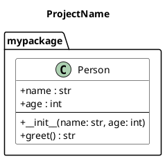

# PlantUML Exporter

The PlantUML exporter converts DRAIT metamodel to PlantUML class diagram syntax for visualization.

## Features

- ✅ Export classes with attributes and methods
- ✅ Support for visibility modifiers (public, protected, private)
- ✅ All relationship types (inheritance, association, composition, aggregation, dependency)
- ✅ Generic types (List[str], Dict[str, int], etc.)
- ✅ Stereotypes and abstract classes
- ✅ Static and abstract methods
- ✅ Multiplicity and role names
- ✅ Package organization

## Quick Start

```python
from drait.metamodel import Project, Package, Class
from drait.exporters.plantuml import PlantUMLExporter

# Create your metamodel
project = Project(name="MyProject", packages=[...])

# Export to PlantUML
exporter = PlantUMLExporter()
plantuml_text = exporter.export_project(project)

# Save to file
with open("diagram.puml", "w") as f:
    f.write(plantuml_text)
```

## Usage

### Basic Export

```python
from drait.exporters.plantuml import export_to_file

# Export project to file
export_to_file(project, "output.puml")
```

### Customization

```python
# Export without methods
exporter = PlantUMLExporter(include_methods=False)

# Export without attributes
exporter = PlantUMLExporter(include_attributes=False)

# Export attributes only
exporter = PlantUMLExporter(include_methods=False, include_attributes=True)
```

## Output Format

The exporter generates standard PlantUML syntax:



## Visibility Mapping

| DRAIT Visibility | PlantUML Symbol | Python Convention |
|-----------------|-----------------|-------------------|
| PUBLIC          | `+`             | `name`            |
| PROTECTED       | `#`             | `_name`           |
| PRIVATE         | `-`             | `__name`          |

## Relationship Mapping

| DRAIT Relationship | PlantUML Arrow | Description          |
|-------------------|----------------|----------------------|
| INHERITANCE       | `<|--`         | Class inheritance    |
| REALIZATION       | `<|..`         | Interface implementation |
| ASSOCIATION       | `-->`          | General association  |
| AGGREGATION       | `o--`          | Weak ownership       |
| COMPOSITION       | `*--`          | Strong ownership     |
| DEPENDENCY        | `..>`          | Dependency           |

## Type Formatting

### Simple Types
```python
TypeReference(name="str") → "str"
TypeReference(name="int") → "int"
```

### Optional Types
```python
TypeReference(name="int", is_optional=True) → "Optional[int]"
```

### Generic Types
```python
TypeReference(
    name="List",
    type_arguments=[TypeReference(name="str")]
) → "List[str]"
```

### Nested Generics
```python
TypeReference(
    name="Dict",
    type_arguments=[
        TypeReference(name="str"),
        TypeReference(name="List", type_arguments=[TypeReference(name="int")])
    ]
) → "Dict[str, List[int]]"
```

## Viewing Generated Diagrams

### Option 1: PlantUML CLI

1. Install PlantUML: https://plantuml.com/download
2. Generate PNG:
   ```bash
   plantuml diagram.puml
   ```
3. Output: `diagram.png`

### Option 2: Online PlantUML

1. Copy generated PlantUML text
2. Paste into: https://www.plantuml.com/plantuml/uml/
3. View diagram instantly

### Option 3: VSCode Extension

1. Install PlantUML extension
2. Open `.puml` file
3. Press `Alt+D` to preview

### Option 4: IntelliJ/PyCharm

1. Install PlantUML integration plugin
2. Open `.puml` file
3. Preview pane shows diagram

## Examples

See [examples/export_to_plantuml.py](../../examples/export_to_plantuml.py) for a complete example.

### Example Output

Running the example:
```bash
python3 examples/export_to_plantuml.py
```

Generates a diagram with:
- Abstract `Person` class with protected and public attributes
- `Employee` class inheriting from `Person`
- `Department` class with composition relationship to `Employee`
- Full type annotations and visibility markers

## Advanced Features

### Stereotypes

```python
cls = Class(
    name="Entity",
    stereotypes=["entity", "persistent"]
)
```

Output:
```plantuml
class Entity <<entity, persistent>> {
}
```

### Abstract Classes and Methods

```python
cls = Class(
    name="BaseClass",
    is_abstract=True,
    methods=[
        Method(name="process", is_abstract=True)
    ]
)
```

Output:
```plantuml
abstract class BaseClass {
  + {abstract} process()
}
```

### Multiplicity and Roles

```python
rel = Relationship(
    type=RelationshipType.COMPOSITION,
    source_id=dept.id,
    target_id=emp.id,
    source_role="employer",
    target_role="employees",
    source_multiplicity=Multiplicity.ONE,
    target_multiplicity=Multiplicity.MANY,
)
```

Output:
```plantuml
Department "1" *-- "*" Employee : employer / employees
```

## Limitations

- No support for notes/comments yet
- No support for diagram layout hints (positions not used)
- No support for custom colors per class
- Package nesting limited to one level

## Future Enhancements

- [ ] Support for PlantUML notes
- [ ] Custom styling per class
- [ ] Layout hints from Position information
- [ ] Sequence diagram export
- [ ] Component diagram export
- [ ] Export to other diagram formats (Mermaid, GraphViz)

## Testing

Run tests:
```bash
pytest tests/test_plantuml_exporter.py -v
```

Test coverage includes:
- ✅ Simple class export
- ✅ Abstract classes
- ✅ Visibility symbols
- ✅ Generic types
- ✅ Method parameters
- ✅ All relationship types
- ✅ Stereotypes
- ✅ Complete model roundtrip

## See Also

- [Metamodel Documentation](../design/metamodel.md)
- [PlantUML Documentation](https://plantuml.com/class-diagram)
- [Examples Directory](../../examples/)
